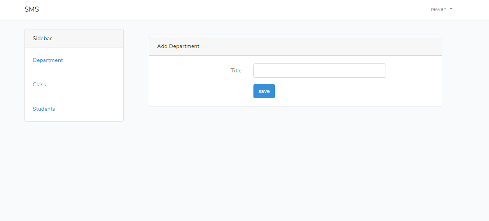
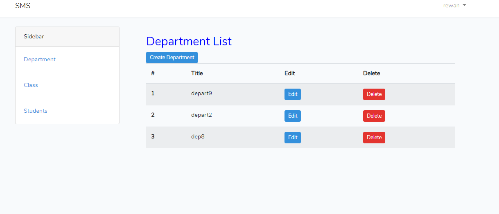
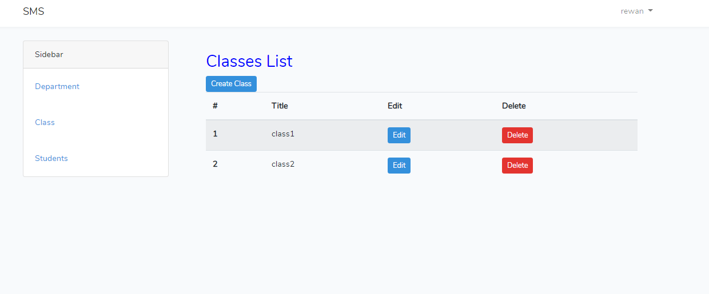
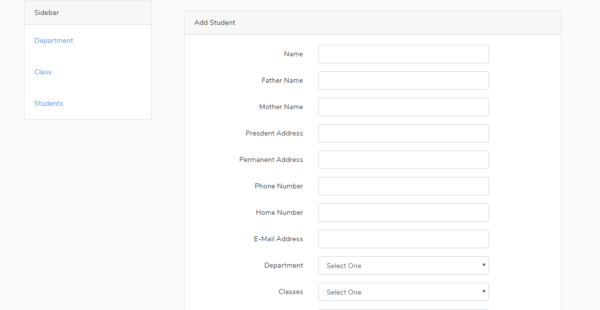
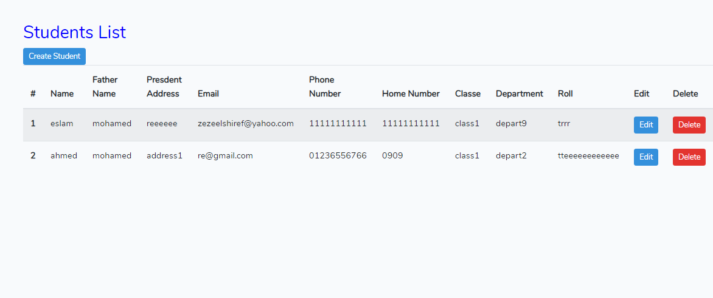

# CRUD-App-with-Authorization using laravel 
(add ,remove ,edit ) students . (add ,remove ,edit ) classes multi user (admin can delete , edit ,add ).(teacher can edit ,add, student ) .(student can edit its own data ) 

# login as student

